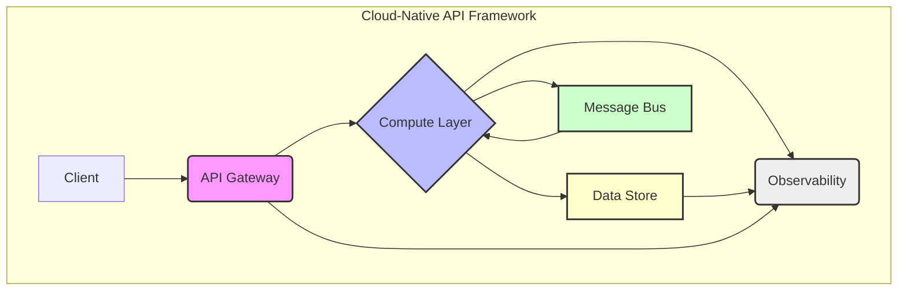
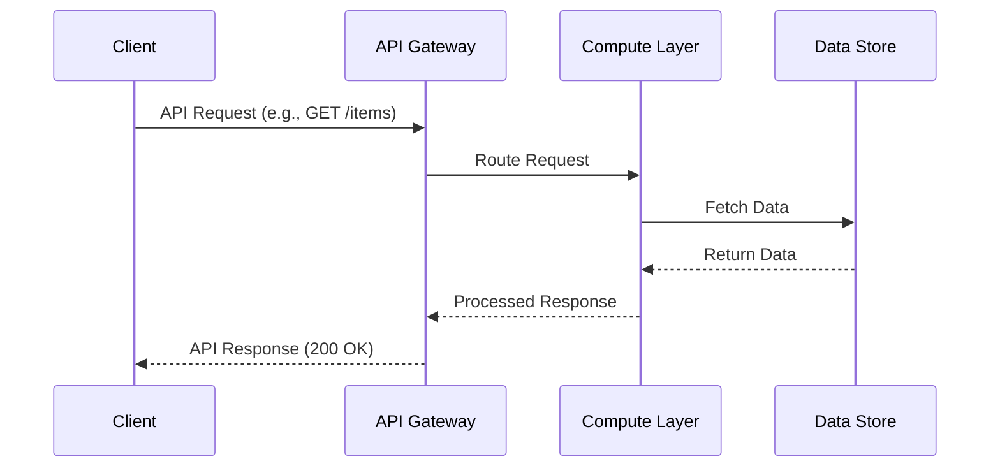

# High TPS API Service

## 1. Business Context

### Purpose
To accelerate the development and deployment of mission-critical, high-transaction-per-second (TPS) API services, ensuring consistent architectural patterns, operational excellence, and adherence to enterprise-grade performance and reliability standards across the organization. This framework aims to reduce time-to-market for new services requiring extreme scale and resilience.

### What problem this solves?
Addresses the challenges associated with developing and operating high-volume, low-latency API services, specifically:
1.  **Inconsistent Implementations**: Eliminates disparate approaches to building scalable APIs, leading to fragmented architectures and increased maintenance burden.
2.  **Lack of Resilience**: Mitigates cascading failures and service degradation under load by enforcing robust fault tolerance mechanisms like strict circuit breaking.
3.  **Scalability Bottlenecks**: Provides a proven, cloud-native architecture designed for horizontal scaling on AWS, preventing performance ceilings.
4.  **Operational Complexity**: Standardizes deployment, monitoring, and management practices, reducing operational overhead and improving incident response times for critical services.

### Key characteristics
-   **High Performance & Scalability**: Engineered for extreme transaction per second (TPS) capabilities and low-latency responses, leveraging asynchronous processing and efficient resource utilization. Designed for horizontal scalability on AWS.
-   **Robust Resilience & Fault Tolerance**: Incorporates a strict circuit breaker pattern at critical integration points to prevent cascading failures and ensure service stability under adverse conditions. Includes retry mechanisms and graceful degradation strategies.
-   **Efficient Internal Communication**: Mandates gRPC for all internal service-to-service communication, optimizing for performance, strong typing, and efficient serialization.
-   **Cloud-Native AWS Deployment**: Optimized for deployment within the Amazon Web Services (AWS) ecosystem, leveraging services like Amazon ECS/EKS, Lambda, API Gateway, DynamoDB/Aurora, and SQS/SNS for managed infrastructure and scalability.
-   **Operational Excellence**: Provides built-in observability (logging, metrics, tracing), automated deployment pipelines (CI/CD), and standardized configuration management to ensure ease of operation and rapid incident response.
-   **Security by Design**: Integrates security best practices from the ground up, including authentication, authorization, data encryption in transit and at rest, and adherence to AWS security guidelines.

## 2. Architecture Overview

## 3. Interaction Flow (Happy path)

