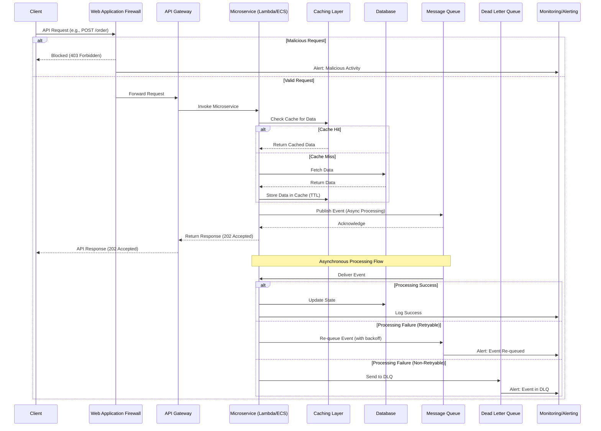

# P2. Architecture

## 1. Architecture Diagram (deep)

```mermaid
graph LR
    subgraph Client & Edge
        A[External Client] --> B(CDN/WAF)
        B --> C(API Gateway)
    end

    subgraph Core Services (High-Throughput, Low-Latency)
        C --> D{Lambda/ECS Microservices}
        D --> E[Caching Layer (e.g., ElastiCache)]
        E --> D
        D --> F[NoSQL DB (e.g., DynamoDB)]
        D --> G[Relational DB (e.g., Aurora)]
        D --> H[Message Queue (e.g., SQS/Kafka)]
        H --> D
    end

    subgraph Operational Efficiency & Resilience
        D --> I[Logging (e.g., CloudWatch Logs)]
        D --> J[Monitoring (e.g., Prometheus/CloudWatch Metrics)]
        D --> K[Tracing (e.g., X-Ray/Jaeger)]
        C --> J
        H --> J
        F --> J
        G --> J
        subgraph CI/CD Pipeline
            L[Source Control] --> M(Build & Test)
            M --> N(Deploy)
            N --> D
        end
    end

    style A fill:#fff,stroke:#333,stroke-width:2px
    style B fill:#f9f,stroke:#333,stroke-width:2px
    style C fill:#f9f,stroke:#333,stroke-width:2px
    style D fill:#bbf,stroke:#333,stroke-width:2px
    style E fill:#ffc,stroke:#333,stroke-width:2px
    style F fill:#ffc,stroke:#333,stroke-width:2px
    style G fill:#ffc,stroke:#333,stroke-width:2px
    style H fill:#cfc,stroke:#333,stroke-width:2px
    style I fill:#eee,stroke:#333,stroke-width:2px
    style J fill:#eee,stroke:#333,stroke-width:2px
    style K fill:#eee,stroke:#333,stroke-width:2px
    style L fill:#ddd,stroke:#333,stroke-width:2px
    style M fill:#ddd,stroke:#333,stroke-width:2px
    style N fill:#ddd,stroke:#333,stroke-width:2px
```

## 2. Interaction Flow (deep)



## 3. Data Architecture

## P2: Data Architecture

Our data architecture is engineered to support high-throughput, low-latency API services within a cloud-native framework, prioritizing resilience, scalability, and operational efficiency through opinionated technology choices.

### Core Principles:
1.  **Performance at Scale:** Achieve predictable low-latency reads and writes even under extreme load.
2.  **High Availability & Durability:** Leverage cloud-native services for automatic replication, backup, and disaster recovery.
3.  **Operational Simplicity:** Favor managed services to reduce operational overhead.
4.  **Cost Efficiency:** Optimize data storage and access patterns to manage cloud costs effectively.
5.  **Data Consistency:** Apply appropriate consistency models (strong vs. eventual) based on business requirements.

### Opinionated Technology Choices:

#### 1. Primary Data Stores:
*   **AWS DynamoDB (NoSQL Key-Value/Document Store):**
    *   **Rationale:** Chosen for its predictable single-digit millisecond latency at any scale, high availability, and flexible schema. It's ideal for high-volume, low-latency access patterns such as session management, user profiles, product catalogs, and event sourcing.
    *   **Usage:** Default choice for most microservice data where a relational model is not strictly required. Emphasize careful partition key design to distribute load evenly and avoid hot spots. Utilize Global Secondary Indexes (GSIs) for alternative access patterns.
*   **AWS Aurora (PostgreSQL/MySQL Compatible Relational Database):**
    *   **Rationale:** For workloads requiring strong ACID properties, complex transactional integrity, and sophisticated querying capabilities (e.g., financial transactions, critical business logic). Aurora provides high performance, scalability, and enterprise-grade features as a managed service.
    *   **Usage:** Reserved for specific use cases where relational integrity and complex joins are paramount. Leverage read replicas for scaling read throughput and ensure proper connection pooling.

#### 2. Caching Layer:
*   **AWS ElastiCache (Redis):**
    *   **Rationale:** Essential for offloading read traffic from primary data stores and achieving sub-millisecond response times for frequently accessed data. Redis offers versatile data structures and high performance.
    *   **Usage:** Implement read-through, write-through, or write-back caching strategies judiciously. Critical for reducing database load, especially for high-read-to-write ratio data. TTL (Time-To-Live) management is crucial for data freshness.
*   **In-Memory Caching:**
    *   **Rationale:** For extremely hot data within service instances, providing the lowest possible latency.
    *   **Usage:** Use sparingly and with robust invalidation strategies to maintain consistency.

#### 3. Event Streaming & Messaging:
*   **AWS Kinesis (or Apache Kafka):**
    *   **Rationale:** For capturing real-time events, enabling event-driven architectures, asynchronous processing, and decoupling services. Provides high-throughput, durable, and ordered message delivery.
    *   **Usage:** Ideal for audit logging, Change Data Capture (CDC), real-time analytics pipelines, and inter-service communication where eventual consistency is acceptable and high fan-out is required.

### Data Consistency Models:
*   **Strong Consistency:** Applied to critical transactional data (e.g., financial ledgers) using Aurora or DynamoDB's strongly consistent reads where necessary.
*   **Eventual Consistency:** Preferred for high-throughput, low-latency scenarios where immediate consistency across all replicas is not strictly required (e.g., user profiles, product views). Leverage DynamoDB's eventually consistent reads and event-driven patterns.

### Data Modeling & Access Patterns:
*   **NoSQL:** Prioritize denormalization for read performance. Design access patterns *before* schema definition. Optimize partition and sort keys for efficient querying.
*   **Relational:** Adhere to normalized forms where appropriate, but denormalize for specific read-heavy queries to improve performance. Utilize proper indexing.
*   **Data Access Layer (DAL):** Standardized DAL within each service to abstract data store specifics, enforce best practices (e.g., connection pooling, retry logic), and facilitate future data store migrations.

## 4. Interface Specification

## P2: Interface Specification

This specification defines the standardized communication protocols and patterns for building high-throughput, low-latency API services, ensuring resilience, scalability, and operational efficiency across our cloud-native framework.

### Core Principles:
1.  **Performance:** Optimize for minimal latency and maximum throughput.
2.  **Reliability:** Design for fault tolerance and graceful degradation.
3.  **Standardization:** Enforce consistent patterns for ease of development, maintenance, and interoperability.
4.  **Observability:** Built-in mechanisms for monitoring, logging, and tracing.
5.  **Security:** Secure communication channels and robust authentication/authorization.

### 1. External-Facing APIs (Public/Client-facing):
*   **Protocol:** RESTful HTTP/2 over TLS.
    *   **Rationale:** HTTP/2 offers multiplexing, header compression, and server push, improving performance over HTTP/1.1. TLS ensures secure communication.
*   **API Gateway:** AWS API Gateway (or equivalent).
    *   **Rationale:** Provides a unified entry point, handles request routing, authentication/authorization, throttling, caching, and DDoS protection, offloading these concerns from backend services.
*   **Data Format:** JSON (`application/json`).
    *   **Rationale:** Universally supported, human-readable, and efficient for most use cases.
*   **Specification:** OpenAPI (Swagger).
    *   **Rationale:** For clear, machine-readable API documentation, enabling client SDK generation, contract testing, and consistent API design across teams.
*   **Versioning:** URI versioning (`/v1/resource`).
    *   **Rationale:** Simple, cacheable, and widely understood. Major versions indicate breaking changes.
*   **Authentication/Authorization:** OAuth 2.0 / OpenID Connect for user authentication, API Keys for service-to-service or partner access. JWTs for stateless authorization.
*   **Error Handling:** Standardized JSON Problem Details (RFC 7807) for consistent, machine-readable error responses.

### 2. Internal Microservice Communication:

#### A. Synchronous Communication:
*   **Protocol:** gRPC over HTTP/2.
    *   **Rationale:** **Primary choice for internal synchronous communication.** gRPC offers superior performance due to binary serialization (Protocol Buffers), efficient HTTP/2 transport, strong type safety, and built-in support for streaming. It significantly reduces latency and bandwidth consumption compared to REST/JSON for inter-service calls.
*   **Specification:** Protocol Buffers (`.proto` files).
    *   **Rationale:** Provides a strict contract definition, enables code generation in multiple languages, and supports schema evolution.
*   **Service Discovery:** Integrated with a service mesh (e.g., AWS App Mesh, Istio) or cloud-native service discovery (e.g., AWS Cloud Map).
*   **Security:** Mutual TLS (mTLS) for service-to-service authentication and encryption within the service mesh.

#### B. Asynchronous Communication:
*   **Protocol:** Event-driven messaging via AWS Kinesis (for high-throughput streams) or AWS SQS/SNS (for simpler queueing/pub-sub).
    *   **Rationale:** Decouples services, enables eventual consistency, handles backpressure, and facilitates complex event-driven workflows (e.g., Saga patterns). Essential for resilience and scalability in distributed systems.
*   **Data Format:** Protocol Buffers or Avro.
    *   **Rationale:** For structured, schema-governed events, ensuring forward and backward compatibility during schema evolution.
*   **Idempotency:** All message consumers **must** be designed to be idempotent to safely handle duplicate messages.
*   **Dead Letter Queues (DLQs):** Mandatory for handling message processing failures, ensuring no messages are lost and enabling manual inspection/reprocessing.

### 3. Observability & Cross-Cutting Concerns:
*   **Correlation IDs:** All interfaces (internal and external) must propagate a unique correlation ID (e.g., `X-Request-ID` header, `trace_id` in events) for end-to-end distributed tracing and unified logging.
*   **Metrics:** Standardized metrics (latency, error rates, throughput) exposed via Prometheus-compatible endpoints or pushed to cloud monitoring services (e.g., CloudWatch).
*   **Health Checks:** Standardized `/health` and `/ready` endpoints for liveness and readiness probes, providing granular status of service dependencies.